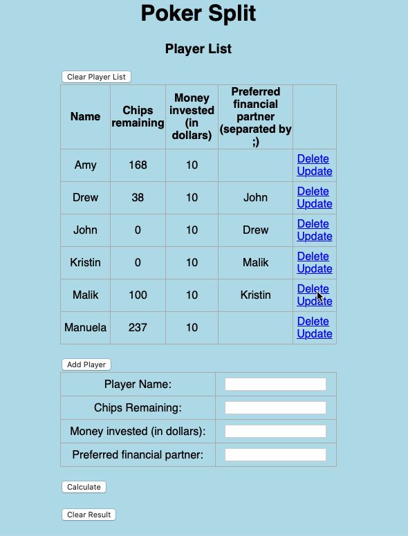

# Poker Split
Find a set of transaction to settle Poker earnings within a group of cash-game players. The earnings are expressed as chips and money invested by each individual. Different people can have different amount of money invested in order to include buy-ins. The programm primarily settles slate between financial partners that prefer to operate together. A slate is primarily settled between financial partners (couples for example) and then settled with other players.

The code can be run via a web app [PokerSplit web app](https://pokersplit.herokuapp.com)

## Running the command line code
`python main.py`

## Running the webapp code
`cd web/` then `python app.py`. To visualize the app, connect to your local host on your favorite browser.

## Demo command line code

## Demo web app

## Acknowledgements
The code heavily relies on the youtube tutorial [Free code camp tutorial](https://www.youtube.com/watch?v=Z1RJmh_OqeA)

## Requirements command line
- Python==3.9.5
- numpy==1.20.3

## Requirements web app
- Python==3.9.5
- asgiref==3.3.4
- backend==0.2.4.1
- click==8.0.1
- Flask==2.0.1
- Flask-SQLAlchemy==2.5.1
- greenlet==1.1.0
- gunicorn==20.1.0
- itsdangerous==2.0.1
- Jinja2==3.0.1
- MarkupSafe==2.0.1
- numpy==1.20.3
- pytz==2021.1
- SQLAlchemy==1.4.17
- sqlparse==0.4.1
- Werkzeug==2.0.1

